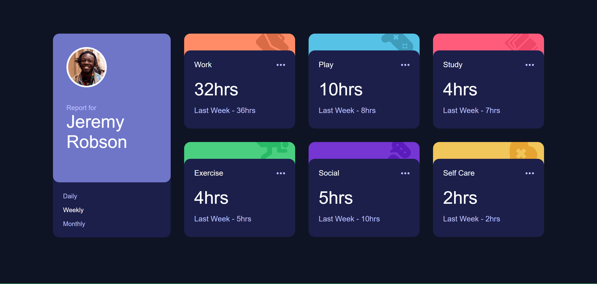
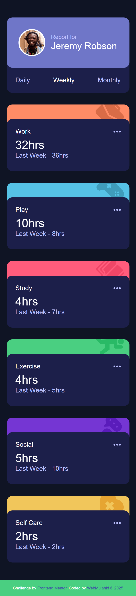

# Frontend Mentor - Time Tracking Dashboard Solution

This is a solution to the [Time Tracking Dashboard challenge on Frontend Mentor](https://www.frontendmentor.io/challenges/time-tracking-dashboard-UIQ7167Jw). This challenge helps build skills in responsive layouts, modular CSS (SCSS), JavaScript DOM manipulation, and state handling based on user interaction.

## Table of contents

- [Overview](#overview)

  - [The challenge](#the-challenge)
  - [Screenshot](#screenshot)
  - [Links](#links)

- [My process](#my-process)

  - [Built with](#built-with)
  - [What I learned](#what-i-learned)
  - [Continued development](#continued-development)
  - [Useful resources](#useful-resources)

- [Author](#author)
- [Acknowledgments](#acknowledgments)

## Overview

### The challenge

Users should be able to:

- View the optimal layout for the site depending on their device's screen size
- See hover states for all interactive elements
- Switch between viewing Daily, Weekly, and Monthly stats dynamically

### Screenshot




### Links

- **Solution URL:** [https://github.com/yourusername/time-tracking-dashboard](https://github.com/yourusername/time-tracking-dashboard)
- **Live Site URL:** [https://webmujahid-time-tracking-dashboard.netlify.app/](https://webmujahid-time-tracking-dashboard.netlify.app/)

## My process

### Built with

- Semantic **HTML5**
- **SCSS** – modular and responsive
- **Flexbox** and **CSS Grid** – for layout
- **Vanilla JavaScript** – for interactivity and dynamic data rendering
- **Mobile-first workflow**

### What I learned

This project helped solidify my understanding of:

- Dynamically updating the DOM based on selected state (daily, weekly, monthly)
- Organizing SCSS files using modular and BEM naming conventions
- Creating reusable components (activity cards) using JavaScript loops
- Ensuring layout adaptability with grid/flex combinations

Example JS snippet for updating cards based on user choice:

```js
function renderData(timeframe) {
  const container = document.querySelector(".activities");
  container.innerHTML = activityData
    .map((activity) => {
      const current = activity.timeframes[timeframe].current;
      const previous = activity.timeframes[timeframe].previous;
      const label =
        timeframe === "daily"
          ? "Yesterday"
          : timeframe === "weekly"
          ? "Last Week"
          : "Last Month";

      return `
        <div class="activity-card ${activity.title.toLowerCase()}">
          <div class="image-container">
            
          </div>
          <article class="activity">
            <div class="title">
              <p>${activity.title}</p>
              
            </div>
            <div class="time">
              <p class="current-time">${current}hrs</p>
              <p class="previous-time">${label} - ${previous}hrs</p>
            </div>
          </article>
        </div>
      `;
    })
    .join("");
}
```

### Continued development

I’d like to expand this in the future to:

- Add animations on switching between timeframes
- Store last-selected timeframe using localStorage
- Use Web Components or a JS framework for better component structure

### Useful resources

- [CSS Tricks Flexbox Guide](https://css-tricks.com/snippets/css/a-guide-to-flexbox/) – Helpful for layout decisions
- [MDN JavaScript DOM manipulation](https://developer.mozilla.org/en-US/docs/Web/API/Document_Object_Model) – Used frequently for dynamic rendering
- [Frontend Mentor Community](https://www.frontendmentor.io/) – For reference and discussion

## Author

- GitHub – [@Abdulgafar-Riro](https://github.com/Abdulgafar-Riro/time-tracking-dashboard-main)
- Frontend Mentor – [@yourusername](https://www.frontendmentor.io/profile/yourusername)
- Twitter – [@yourusername](https://twitter.com/yourusername)

## Acknowledgments

Big thanks to the Frontend Mentor community and challenge creators. Also, shout-out to fellow developers who inspired cleaner layout and SCSS structure strategies through their solutions.
